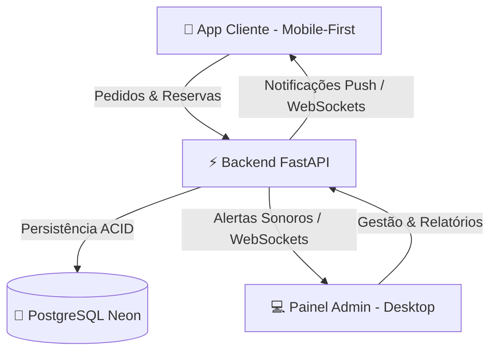

# 🧠🍪 SweetAg Cookies

> *"Alimente sua mente. E sua fome."*

O **SweetAg Cookies** é uma plataforma web híbrida inovadora com foco mobile-first, projetada para a comercialização, gestão operacional e entrega de cookies artesanais temáticos no ambiente universitário de psicologia. Muito mais do que um delivery convencional, o SweetAg Cookies integra uma narrativa divertida baseada em conceitos e teóricos da psicologia com uma experiência comunitária de apoio financeiro estudantil.

---

## 🎨 O Conceito Temático

Os cookies do cardápio não são apenas doces, são **sessões de terapia em formato de chocolate**. A identidade do projeto combina humor inteligente, trocadilhos da psicologia e uma experiência de compra ágil e acolhedora.

### 🧪 Exemplos de Experiências Adocicadas:
*   **Cookie "Freud Supremo":** Para os desejos mais profundos do seu id.
*   **Cookie "Jean Piaget":** Em constante processo de adaptação e assimilação de sabor.
*   **Cookie "Skinner Reforçado":** A recompensa positiva perfeita para o seu comportamento.
*   **Cookie "Inconsciente Coletivo":** Aquele sabor que todo mundo compartilha e deseja.
*   **Cookie "Paciente 404":** Um mistério clínico deliciosamente indescritível.

> 📢 *"Seu cookie entrou em análise."*  
> 📢 *"Seu comportamento indica necessidade urgente de açúcar."*

---

## ⚙️ Arquitetura Geral do Ecossistema

O ecossistema é dividido em duas interfaces especializadas para atender com excelência tanto os clientes quanto a gestão da operação.



### 1. Interface do Cliente (Mobile-First)
*   **Catálogo Dinâmico (Home):** Vitrine interativa de cookies com ingredientes, tabela nutricional e disponibilidade diária.
*   **Checkout Descomplicado:** Seleção ágil de local de entrega interna (sala, bloco, departamento).
*   **Reserva Temporária com Pix:** Garantia de reserva do cookie com temporizador de 30 minutos até a validação do Pix.
*   **Timeline em Tempo Real:** Acompanhamento dinâmico do status do pedido (do recebimento até a entrega concluída).
*   **Agendamentos Futuros:** Calendário para encomendar cookies para datas especiais.
*   **Campanha e Comunidade:** Barra de progresso humanizada que exibe a meta de arrecadação financeira para o custeio de congressos acadêmicos do proprietário.

### 2. Painel Administrativo (Desktop)
*   **Dashboard Executivo:** Visualização rápida de vendas diárias, progresso de metas e cookies mais vendidos.
*   **Gestão de Estoque:** CRUD dinâmico de sabores, edição rápida de preços e controle de itens esgotados.
*   **Controle Operacional:** Painel com alertas sonoros/visuais para aprovação de Pix, novos pedidos e alteração manual de status de entrega.
*   **Gestão de Reservas:** Sistema de triagem para aprovar ou recusar agendamentos futuros.

---

## 🛠️ Stack Tecnológica

| Componente | Tecnologia | Justificativa Técnica | Hospedagem / Infra |
| :--- | :--- | :--- | :--- |
| **Frontend** | Angular + TS + SCSS | Estrutura robusta, componentização escalável e excelente integração reativa via RxJS. | **Vercel** |
| **Backend** | Python + FastAPI | Alta performance assíncrona, documentação OpenAPI automática e suporte nativo a WebSockets. | **Render** |
| **Banco de Dados** | PostgreSQL | Transações estritamente ACID, segurança robusta e excelente controle de concorrência. | **Neon Database** |
| **Comunicação** | WebSockets | Latência inferior a 2 segundos para atualizações em tempo real (timeline e novos pedidos). | - |

---

## 🚦 Regras de Negócio Importantes

*   **RN01 - Estoque Garantido:** O estoque físico nunca poderá ficar negativo. Vendas adicionais de produtos esgotados são bloqueadas instantaneamente.
*   **RN02 - Temporizador Pix:** Ao iniciar o checkout, o estoque é reservado temporariamente por **30 minutos**. Caso o pagamento manual não seja validado pelo administrador nesse período, o pedido expira e o estoque retorna automaticamente ao catálogo.
*   **RN03 - Evolução de Status Unidirecional:** Os status dos pedidos seguem um fluxo cronológico rígido e não podem retroceder:  
    `Recebido ➡️ Pagamento ➡️ Preparação ➡️ Entrega ➡️ Conclusão`
*   **RN04 - Alteração Limite de Endereço:** O cliente só pode alterar o local exato da entrega interna enquanto o status estiver em, no máximo, *Em Preparação*.
*   **RN05 - Autenticação Descomplicada:** O número de WhatsApp do cliente atua como identificador exclusivo. O login é persistido de forma segura via JWT por até 30 dias para evitar fricção.

---

## 📂 Estrutura de Diretórios do Projeto

### Frontend (Angular)
```text
/frontend
  /src
    /app
      /core                  # Serviços globais de singleton (APIs, Websockets, Auth)
        /services
          - websocket.service.ts
          - api.service.ts
          - auth.service.ts
          - notification.service.ts
      /shared                # Componentes globais reutilizáveis
        /components
          - cookie-card.component.ts
          - progress-campaign.component.ts
          - timeline.component.ts
      /modules               # Módulos funcionais da aplicação
        /catalog             # Catálogo principal
        /product-details     # Detalhes do produto
        /checkout            # Fluxo de pagamento
        /auth                # Autenticação e cadastro
        /order-tracking      # Timeline em tempo real
        /campaign            # Página de progresso da meta
        /admin-panel         # Painel administrativo desktop
        /future-orders       # Agendamento de cookies
      - app-routing.module.ts
      - app.component.ts
```

### Backend (FastAPI)
```text
/backend
  /app
    /api                     # Rotas REST e endpoints
    /models                  # Modelos ORM do SQLAlchemy / SQLModel
    /schemas                 # Esquemas de validação Pydantic
    /services                # Regras de negócios e lógica
    /websockets              # Handlers para atualizações em tempo real
    /auth                    # Segurança e gerenciamento JWT
    /notifications           # Lógica para push-notifications / integrações
    /payments                # Gestão e verificação do fluxo Pix
    /orders                  # Processamento de pedidos
    /products                # Lógica do catálogo e estoque
    /reports                 # Geração de dados analíticos para o admin
```

---

## 🚀 Como Executar o Projeto Localmente

### Pré-requisitos
*   **Node.js** (v18+) & **npm**
*   **Python** (v3.10+)
*   Instância ativa do **PostgreSQL** (ou conexão Neon)

### 1. Configurando o Backend (FastAPI)
1. Navegue até o diretório do backend:
   ```bash
   cd backend
   ```
2. Crie e ative um ambiente virtual:
   ```bash
   python -m venv venv
   # No Windows:
   .\venv\Scripts\activate
   # No Linux/macOS:
   source venv/bin/activate
   ```
3. Instale as dependências:
   ```bash
   pip install -r requirements.txt
   ```
4. Configure as variáveis de ambiente `.env` (ex: `DATABASE_URL`, `JWT_SECRET`).
5. Execute as migrações e inicie o servidor:
   ```bash
   uvicorn app.main:app --reload
   ```
   *O backend estará rodando em `http://localhost:8000`.*

### 2. Configurando o Frontend (Angular)
1. Navegue até o diretório do frontend:
   ```bash
   cd frontend
   ```
2. Instale as dependências de pacotes:
   ```bash
   npm install
   ```
3. Execute o servidor de desenvolvimento:
   ```bash
   npm run dev # ou ng serve
   ```
   *O frontend estará rodando em `http://localhost:4200`.*

---

## 🔮 Roadmap & Funcionalidades Futuras (V2)
*   **Integração Automatizada com WhatsApp:** Envio automatizado de status e links de pagamento diretamente pelo WhatsApp (API Oficial Meta).
*   **Gateway de Pagamento Integrado:** Processamento de Pix automático com conciliação imediata via Mercado Pago.
*   **Fidelização e Gamificação:** Cupons de desconto dinâmicos, rankings de clientes e cashback temático ("reforços positivos acumulados").
*   **Rastreamento em Mapa Interno:** Exibição do deslocamento do entregador em tempo real pelo campus universitário.
*   **Recomendador Baseado em IA:** Algoritmos leves sugerindo novos sabores de cookies com base no "perfil comportamental" e histórico de pedidos do cliente.

---

## 📝 Licença e Informações Gerais
*   **Criação do Projeto:** 20/05/2026
*   **Status Atual:** 2.0 (Planejamento e Refinamento)
*   **Contato:** Equipe de desenvolvimento SweetAg Cookies.

---
*SweetAg Cookies: Onde cada mordida é um reforço positivo!* 🍪🧠
